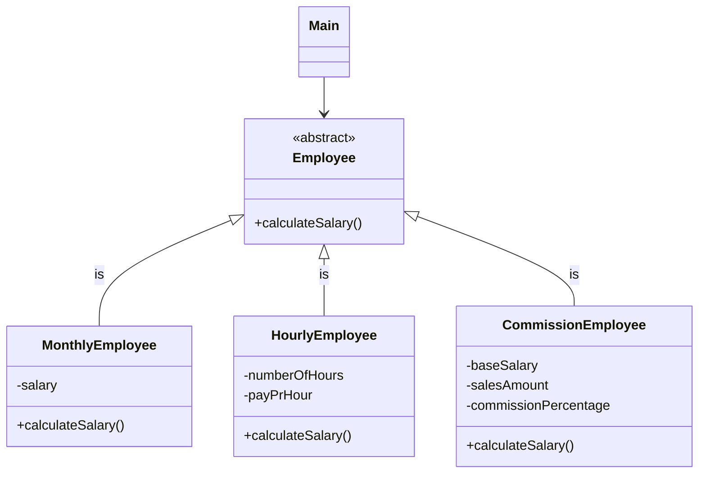

# 1st Semester Exam Assignment – Datamatiker (Computer Science)

## Overview

This repository contains one of five programming assignments that formed the basis of the 1st semester examination in the Datamatiker (Computer Science) program.

All five assignments were handed out in advance and prepared independently. On the day of the exam, a single assignment was drawn at random and formed the basis of the oral examination.

The examination consisted of:
- Code walkthrough and explanation
- Technical questions
- Minor code adjustments and problem solving during the examination

This repository represents the solution as it existed at the time of the exam.

---

## Educational Context

- **Program:** Datamatiker (Computer Science, Academy Profession Degree)
- **Semester:** 1st semester
- **Institution:** Cphbusiness (EK – Erhvervsakademi København, as of mid-2025)
- **Exam Type:** Individual practical programming exam with oral presentation
- **Language:** Java (object-oriented)

- **Completed:** Summer 2025, without the use of AI tools

---

## Experience Level at the Time

At the time this assignment was developed:
- I had been programming for under six months
- I had no prior programming experience before starting the Datamatiker program

The focus of the work was on:
- Fundamental programming concepts
- Problem solving
- Code structure and readability
- Demonstrating understanding under examination conditions

The code has been left unchanged to reflect the level and approach at that point in time.

---

## Class Diagram

---

## Assignment Description

### Dansk (original)

**Lønberegning**

Skriv et program, som beregner løn for medarbejdere. Du skal implementere klassehierarkiet herunder. Find selv på passende datatyper til de viste attributter, og tilføj passende konstruktører til klasserne.

1. `Employee` med en abstrakt metode: `calculateSalary()`. Overvej parameter og returtype.
2. `MonthlyEmployee`, som repræsenterer en månedslønnet medarbejder. Klassen skal have en implementation af metoden `calculateSalary()`, som returnerer månedslønnen.
3. `HourlyEmployee`, som repræsenterer en timelønnet medarbejder. Klassen skal have en implementation af metoden `calculateSalary()`, som ganger antal timer med timelønnen.
4. Lav klassen `CommissionEmployee`, som repræsenterer en provisionslønnet medarbejder. Lad klassen nedarve `Employee`. Klassen skal også have en implementation af metoden `calculateSalary()`: grundløn plus provision af medarbejderens salg.
   - **Eksempel:** *Grundløn 20000 kr. Salg 10000 kr. Provision 20% giver en løn på 22000 kr.*
5. Lav en klasse `Main`.
   - Lav en metode `main`, hvori du instantierer en `ArrayList` af Employee-objekter.
   - Opret et antal objekter af de tre klasser `MonthlyEmployee`, `HourlyEmployee` og `CommissionEmployee` og tilføj dem til listen.
   - Kør listen igennem med et loop og udskriv løn for hvert enkelt objekt.

---

### English (translation)

**Salary Calculation**

Write a program that calculates salaries for employees. You must implement the class hierarchy below. Determine appropriate data types for the shown attributes yourself, and add appropriate constructors to the classes.

1. `Employee` with an abstract method: `calculateSalary()`. Consider the parameter and return type.
2. `MonthlyEmployee`, representing a salaried employee. The class must have an implementation of `calculateSalary()` that returns the monthly salary.
3. `HourlyEmployee`, representing an hourly employee. The class must have an implementation of `calculateSalary()` that multiplies the number of hours by the hourly rate.
4. Create the class `CommissionEmployee`, representing a commission-based employee. Have the class inherit from `Employee`. The class must also implement `calculateSalary()`: base salary plus commission on the employee's sales.
   - **Example:** *Base salary 20,000 kr. Sales 10,000 kr. Commission 20% gives a salary of 22,000 kr.*
5. Create a `Main` class.
   - Create a `main` method in which you instantiate an `ArrayList` of `Employee` objects.
   - Create a number of objects of the three classes `MonthlyEmployee`, `HourlyEmployee`, and `CommissionEmployee` and add them to the list.
   - Iterate through the list and print the salary for each object.

---

## License

This project is licensed under the MIT License – see the [LICENSE](./LICENSE) file for details.
